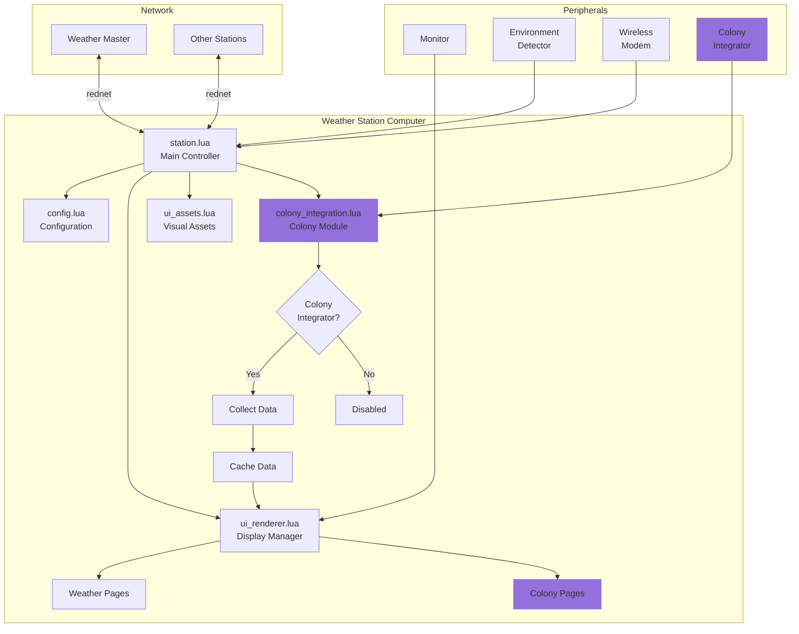
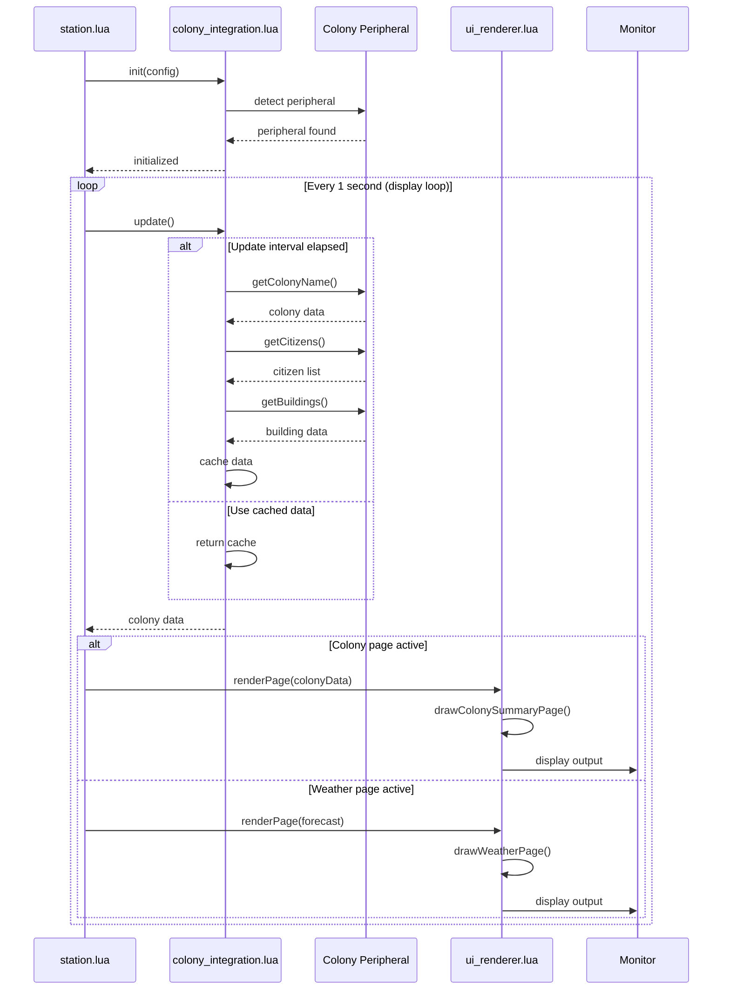
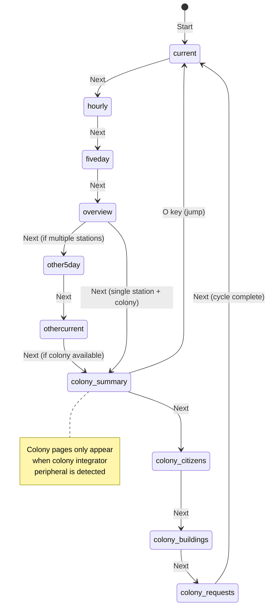

# Colony Integration Design Plan
## Weather Station Colony Monitoring Module

**Version:** 1.0.0  
**Date:** 2026-01-25  
**Target:** weatherSystem/station integration with MineColonies

---

## Executive Summary

This design plan details the integration of MineColonies colony monitoring into the existing weather station system. The integration will be modular, optional, and follow established architectural patterns. When a colony integrator peripheral is detected, the station will collect colony metrics and display them across multiple dedicated pages alongside weather information.

---

## 1. Architecture Analysis

### 1.1 Existing Patterns Identified

From analyzing [`station.lua`](weatherSystem/station/station.lua:1), [`ui_renderer.lua`](weatherSystem/station/ui_renderer.lua:1), [`config.lua`](weatherSystem/station/config.lua:1), and [`ui_assets.lua`](weatherSystem/station/ui_assets.lua:1):

**Peripheral Detection Pattern:**
- Iterate through `peripheral.getNames()`
- Use `peripheral.getType()` with pattern matching
- Wrap peripheral and store reference
- Graceful degradation if not found

**Module Loading Pattern:**
- Use `dofile()` for loading modules
- Modules return table with functions
- Initialize modules with dependencies (e.g., `renderer.init(monitor, assets, config)`)

**Data Structure Pattern:**
- Global state variables at module level
- Nested tables for complex data (e.g., `localBiomeData`)
- Caching for expensive operations

**Display Management:**
- Page-based system with `pageList` array
- `currentPage` state variable
- `renderPage()` function dispatches to specific page renderers
- Support for standard (51x19) and large (60x25+) displays
- Adaptive layouts with `isLargeDisplay` and `isXLDisplay` flags

**Config Management:**
- JSON persistence to `*_config.json` files
- `load()` and `save()` functions
- Settings organized in nested tables
- Interactive setup on first run

**Parallel Execution:**
- `parallel.waitForAny()` for concurrent loops
- Separate loops: heartbeat, receive, display, cycle, input
- Each loop has specific responsibility

---

## 2. Module Structure: colony_integration.lua

### 2.1 File Location
```
weatherSystem/station/colony_integration.lua
```

### 2.2 Module Interface (Public API)

```lua
-- Module structure
local colonyIntegration = {
    -- State
    enabled = false,              -- Whether colony integration is active
    peripheral = nil,             -- Wrapped colony integrator peripheral
    lastUpdate = 0,               -- Timestamp of last data collection
    data = nil,                   -- Cached colony data
    
    -- Configuration (passed from config.lua)
    config = {
        updateInterval = 30,      -- Seconds between data collection
        enableCitizens = true,    -- Collect citizen data
        enableBuildings = true,   -- Collect building data
        enableRequests = true,    -- Collect request data
        enableResearch = true,    -- Collect research data
        enableVisitors = true     -- Collect visitor data
    }
}
```

### 2.3 Public Functions

#### `init(configTable)`
Initialize the colony integration module.
- **Parameters:** `configTable` - colony configuration from config.lua
- **Returns:** `boolean` - true if colony peripheral found and initialized
- **Side Effects:** Sets `enabled`, `peripheral`, loads config

#### `detect()`
Scan for and wrap colony integrator peripheral.
- **Parameters:** None
- **Returns:** `peripheral` or `nil`
- **Pattern:** Iterate `peripheral.getNames()`, match "colony" type

#### `update()`
Collect fresh data from colony peripheral (respects update interval).
- **Parameters:** None
- **Returns:** `boolean` - true if update performed
- **Side Effects:** Updates `lastUpdate` and `data` cache

#### `getData()`
Get cached colony data.
- **Parameters:** None
- **Returns:** `table` or `nil` - cached colony data structure

#### `isAvailable()`
Check if colony integration is enabled and functioning.
- **Parameters:** None
- **Returns:** `boolean`

#### `getStatus()`
Get human-readable status for debugging.
- **Parameters:** None
- **Returns:** `string` - status message

---

## 3. Data Collection Strategy

### 3.1 Data Structure

```lua
colonyData = {
    -- Metadata
    timestamp = 1706140800000,        -- UTC epoch ms
    colonyId = 1,                     -- Colony ID
    colonyName = "New Haven",         -- Colony name
    colonyStyle = "medieval_oak",     -- Colony style
    location = {x=100, y=64, z=200},  -- Town hall location
    
    -- Summary metrics
    summary = {
        citizenCount = 42,            -- Current citizens
        maxCitizens = 50,             -- Max capacity
        happiness = 7.5,              -- Overall happiness (0-10)
        isActive = true,              -- Colony active status
        isUnderAttack = false,        -- Under attack flag
        gravesCount = 3,              -- Current graves
        constructionSites = 2         -- Active construction sites
    },
    
    -- Citizens (top-level data only, limited to first N for performance)
    citizens = {
        {
            id = "citizen_1",
            name = "John Smith",
            age = "adult",
            gender = "male",
            health = 18,
            maxHealth = 20,
            happiness = 8.2,
            saturation = 15.5,
            isIdle = false,
            state = "working",
            job = "Miner",
            workBuilding = "Mine"
        },
        -- ... limited to ~10-20 for performance
    },
    
    -- Buildings summary
    buildings = {
        total = 18,
        built = 15,
        underConstruction = 2,
        byType = {
            ["House"] = 8,
            ["Farm"] = 3,
            ["Mine"] = 1,
            ["Bakery"] = 1,
            -- ...
        },
        byLevel = {
            [1] = 5,
            [2] = 7,
            [3] = 3
        }
    },
    
    -- Active requests (limited to first N)
    requests = {
        count = 5,
        items = {
            {
                id = "req_1",
                name = "Oak Planks",
                count = 64,
                state = "IN_PROGRESS",
                target = "Builder's Hut"
            },
            -- ... limited to ~10
        }
    },
    
    -- Research summary
    research = {
        total = 45,
        completed = 23,
        inProgress = 2,
        available = 8,
        locked = 12,
        currentProgress = {
            name = "Advanced Mining",
            progress = 65  -- percentage
        }
    },
    
    -- Visitors (if tavern exists)
    visitors = {
        count = 3,
        names = {"Wanderer", "Trader", "Scout"}
    }
}
```

### 3.2 Caching Strategy

**Update Interval:** 30 seconds (configurable)
- Prevents excessive peripheral calls
- Balances freshness with performance
- Aligns with weather station's `COLLECT_INTERVAL`

**Lazy Loading:**
- Only call peripheral methods if feature enabled in config
- Skip expensive calls (e.g., `getCitizens()` if disabled)

**Data Limits:**
- Citizens: Top 20 by happiness/health priority
- Requests: First 10 active requests
- Buildings: Summary statistics, not full list

**Error Handling:**
- `pcall()` wrapper for all peripheral calls
- Return cached data if update fails
- Log errors but continue operation
- Set `enabled = false` if peripheral disappears

---

## 4. Display Pages Design

### 4.1 Page Overview

Add **4 new pages** to the existing page cycle:

1. **colony_summary** - Overview metrics and status
2. **colony_citizens** - Citizen list with job/health
3. **colony_buildings** - Building statistics and construction
4. **colony_requests** - Active requests and research

### 4.2 Page Cycle Integration

**Updated Page List** (when colony available):
```lua
pageList = {
    "current",           -- Weather: Current conditions
    "hourly",            -- Weather: 24-hour forecast
    "fiveday",           -- Weather: 5-day forecast
    "overview",          -- Weather: All stations
    "other5day",         -- Weather: Other station 5-day (if multiple stations)
    "othercurrent",      -- Weather: Other station current (if multiple stations)
    "colony_summary",    -- Colony: Overview
    "colony_citizens",   -- Colony: Citizens
    "colony_buildings",  -- Colony: Buildings
    "colony_requests"    -- Colony: Requests & Research
}
```

### 4.3 Page Specifications

#### 4.3.1 Colony Summary Page

**Header:** `[Colony Name] | [X/Y] 1/4 Summary`

**Standard Display (51x19):**
```
================================================
 [Colony Name]            12:00   1/4 Summary
------------------------------------------------
 Colony Overview

 Name: New Haven
 Citizens: 42 / 50 (84%)        [========  ]
 Happiness: 7.5 / 10.0          [=======   ]
 Status: Active
 
 Buildings: 18 total
   Built: 15
   Under Construction: 2
 
 Requests: 5 active
 Research: 23 / 45 complete
 
 Graves: 3
 
 Location: (100, 64, 200)
================================================
         Day 150 | Weather Station v6.x
================================================
```

**Large Display (60x25+):**
- Add small building icons
- Show top 3 requests inline
- Display construction progress bars
- Add research progress visualization

**Colors:**
- Colony name: `colors.yellow` (highlight)
- Progress bars: `colors.lime` for filled, `colors.gray` for empty
- Status indicators: `colors.lime` (Active), `colors.red` (Under Attack), `colors.orange` (Inactive)
- Metrics: `colors.white` (primary text), `colors.lightGray` (secondary)

---

#### 4.3.2 Colony Citizens Page

**Header:** `[Colony Name] | [X/Y] 2/4 Citizens`

**Standard Display (51x19):**
```
================================================
 [Colony Name]            12:00  2/4 Citizens
------------------------------------------------
 Citizens (42 / 50)

 Name            Job         HP    Happy  Status
 ------------------------------------------------
 >John Smith     Miner       18/20  8.2   Work
  Mary Jones     Farmer      20/20  9.1   Work
  Bob Wilson     Builder     15/20  6.5   Idle
  Alice Brown    Baker       20/20  8.8   Work
  Tom Davis      Courier     17/20  7.2   Travel
  Sarah Miller   Teacher     20/20  9.5   Work
  James Garcia   Guard       19/20  7.8   Patrol
  Emma Johnson   Cook        20/20  8.3   Work
  
 Idle: 3  Working: 35  Sleeping: 4
================================================
         Day 150 | Weather Station v6.x
================================================
```

**Large Display (60x25+):**
- Show more citizens (15-20)
- Add health bars (visual)
- Show saturation levels
- Display child/adult icons
- Color-code by health status

**Colors:**
- Names: `colors.white`
- Job: `colors.yellow`
- Health: Green (>15), Yellow (10-15), Red (<10)
- Happiness: `colors.lime` (>8), `colors.orange` (5-8), `colors.red` (<5)
- Status: `colors.cyan` (working), `colors.gray` (idle), `colors.purple` (sleeping)

**Sorting:** By happiness (descending), then by health

---

#### 4.3.3 Colony Buildings Page

**Header:** `[Colony Name] | [X/Y] 3/4 Buildings`

**Standard Display (51x19):**
```
================================================
 [Colony Name]            12:00 3/4 Buildings
------------------------------------------------
 Buildings (18 total, 15 built)

 Type             Count  Avg Lvl  Built
 ------------------------------------------------
 House              8      2.1      8/8
 Farm               3      1.7      3/3
 Mine               1      3.0      1/1
 Bakery             1      2.0      1/1
 Guard Tower        2      2.0      2/2
 Builder's Hut      1      3.0      1/1
 Town Hall          1      5.0      1/1
 Warehouse          1      1.0    [BUILDING]
 
 Under Construction:
 - Warehouse (priority: 5)
 - Guard Tower (priority: 3)
 
================================================
         Day 150 | Weather Station v6.x
================================================
```

**Large Display (60x25+):**
- Show building icons (ASCII symbols)
- Display construction progress bars
- Show storage capacity for warehouses
- List guarded buildings

**Colors:**
- Building names: `colors.white`
- Level indicators: `colors.lime` (Lv3+), `colors.yellow` (Lv2), `colors.lightGray` (Lv1)
- Construction: `colors.orange` with progress indicator
- Counts: `colors.cyan`

---

#### 4.3.4 Colony Requests & Research Page

**Header:** `[Colony Name] | [X/Y] 4/4 Requests`

**Standard Display (51x19):**
```
================================================
 [Colony Name]            12:00  4/4 Requests
------------------------------------------------
 Active Requests (5)

 Item              Qty   Target           Status
 ------------------------------------------------
 Oak Planks         64   Builder's Hut    PROGRESS
 Stone Bricks       32   Town Hall        PROGRESS
 Iron Ingots        16   Blacksmith       REQUESTED
 Wheat              128  Farm             PROGRESS
 Coal               64   Mine             REQUESTED
 
 Research Progress
 
 Completed: 23 / 45 (51%)    [=====     ]
 In Progress: Advanced Mining (65%)
 Available: 8 new technologies
 
 Next: Improved Tools, Advanced Farming
 
================================================
         Day 150 | Weather Station v6.x
================================================
```

**Large Display (60x25+):**
- Show request priority levels
- Display research tree preview (branches)
- Add item icons (using symbols)
- Show research costs

**Colors:**
- Item names: `colors.white`
- Status: `colors.lime` (complete), `colors.yellow` (in progress), `colors.lightGray` (requested)
- Research: `colors.cyan` (available), `colors.green` (complete), `colors.orange` (in progress)
- Progress bars: `colors.lime` for filled portions

---

## 5. Configuration Additions

### 5.1 config.lua Modifications

Add new section to config table:

```lua
-- Colony integration settings
COLONY = {
    ENABLED = true,                    -- Enable colony integration (auto-detect)
    UPDATE_INTERVAL = 30,              -- Seconds between colony data updates
    SHOW_PAGES = true,                 -- Include colony pages in rotation
    
    -- Data collection toggles
    COLLECT_CITIZENS = true,           -- Collect citizen data
    COLLECT_BUILDINGS = true,          -- Collect building data  
    COLLECT_REQUESTS = true,           -- Collect request data
    COLLECT_RESEARCH = true,           -- Collect research data
    COLLECT_VISITORS = true,           -- Collect visitor data
    
    -- Display options
    MAX_CITIZENS_DISPLAY = 15,         -- Max citizens to show in list
    MAX_REQUESTS_DISPLAY = 10,         -- Max requests to show
    SORT_CITIZENS_BY = "happiness",    -- "happiness", "health", "name"
    SHOW_IDLE_CITIZENS = true          -- Show idle citizens in list
}
```

### 5.2 Config File Persistence

Update `config.save()` to include `COLONY` section:

```lua
saveData = {
    -- ... existing fields
    COLONY = config.COLONY
}
```

### 5.3 Interactive Setup

Add colony configuration to `interactiveSetup()`:

```
Colony Integration Setup
------------------------
Enable colony monitoring? (Y/n): Y
Update interval (seconds, default 30): 30
Show colony pages in rotation? (Y/n): Y
```

---

## 6. UI Assets Additions

### 6.1 ui_assets.lua New Assets

#### 6.1.1 Colony Colors

```lua
-- Add to assets.colors table
colony = colors.purple,          -- Colony theme color
colonyCitizen = colors.lime,     -- Citizen indicator
colonyBuilding = colors.orange,  -- Building indicator
colonyRequest = colors.yellow,   -- Request indicator
colonyResearch = colors.cyan,    -- Research indicator
colonyDanger = colors.red,       -- Alert/danger
colonyInactive = colors.gray,    -- Inactive status

-- Health indicators
healthGood = colors.lime,        -- >75% health
healthMedium = colors.yellow,    -- 50-75% health
healthLow = colors.orange,       -- 25-50% health
healthCritical = colors.red,     -- <25% health

-- Happiness indicators
happyHigh = colors.lime,         -- 8+ happiness
happyMedium = colors.yellow,     -- 5-8 happiness
happyLow = colors.red            -- <5 happiness
```

#### 6.1.2 Colony Symbols

```lua
-- Add to assets.symbols table or create new section
colonySymbols = {
    citizen = "@",               -- Citizen marker
    citizenChild = "o",          -- Child marker
    building = "#",              -- Building marker
    construction = "*",          -- Under construction
    request = "!",               -- Request marker
    research = "R",              -- Research marker
    grave = "+",                 -- Grave marker
    visitor = "?",               -- Visitor marker
    townhall = "H",              -- Town hall
    house = "h",                 -- House
    farm = "F",                  -- Farm
    mine = "M",                  -- Mine
    guard = "G",                 -- Guard tower
    warehouse = "W",             -- Warehouse
    workshop = "w",              -- Workshop
    
    -- Status indicators
    working = ">",               -- Working status
    idle = "-",                  -- Idle status
    sleeping = "z",              -- Sleeping status
    traveling = "~"              -- Traveling status
}
```

#### 6.1.3 Colony Icons (3x3)

```lua
colonyIcons = {
    citizen = {
        " @ ",
        "/|\\",
        "/ \\"
    },
    building = {
        "/\\",
        "||",
        "=="
    },
    townhall = {
        "^^^",
        "|||",
        "==="
    },
    request = {
        " ! ",
        "[?]",
        " ! "
    }
}
```

#### 6.1.4 Helper Functions

```lua
-- Get health color based on percentage
function assets.getHealthColor(current, max)
    local percent = (current / max) * 100
    if percent > 75 then return assets.colors.healthGood
    elseif percent > 50 then return assets.colors.healthMedium
    elseif percent > 25 then return assets.colors.healthLow
    else return assets.colors.healthCritical
    end
end

-- Get happiness color based on value (0-10 scale)
function assets.getHappinessColor(happiness)
    if happiness >= 8 then return assets.colors.happyHigh
    elseif happiness >= 5 then return assets.colors.happyMedium
    else return assets.colors.happyLow
    end
end

-- Get job status color
function assets.getStatusColor(status)
    local statusColors = {
        working = colors.cyan,
        idle = colors.gray,
        sleeping = colors.purple,
        traveling = colors.yellow
    }
    return statusColors[status:lower()] or colors.white
end

-- Get colony icon
function assets.getColonyIcon(type)
    return assets.colonyIcons[type] or assets.colonyIcons.building
end
```

---

## 7. station.lua Integration Points

### 7.1 Module Loading (Lines 8-54)

**After loading ui_renderer:**

```lua
-- Load colony integration (after renderer loading, around line 51)
local colonyIntegration = nil
if config.COLONY and config.COLONY.ENABLED then
    colonyIntegration = dofile("weatherSystem/station/colony_integration.lua")
    if colonyIntegration.init(config.COLONY) then
        print("[INFO] Colony integration enabled")
    else
        print("[INFO] No colony peripheral - colony integration disabled")
        colonyIntegration = nil
    end
end
```

### 7.2 State Variables (Lines 72-88)

**Add colony state:**

```lua
-- Colony state (after display state section)
local colonyData = nil
local lastColonyUpdate = 0
```

### 7.3 Page List Management (Lines 83-86)

**Update `getActivePageList()` function:**

```lua
-- Get current page list based on available features
local function getActivePageList()
    local pages = {"current", "hourly", "fiveday", "overview"}
    
    -- Add other station pages if multiple stations exist
    if #allStations > 1 then
        table.insert(pages, "other5day")
        table.insert(pages, "othercurrent")
    end
    
    -- Add colony pages if colony integration is active
    if colonyIntegration and colonyIntegration.isAvailable() and 
       config.COLONY and config.COLONY.SHOW_PAGES then
        table.insert(pages, "colony_summary")
        table.insert(pages, "colony_citizens")
        table.insert(pages, "colony_buildings")
        table.insert(pages, "colony_requests")
    end
    
    return pages
end
```

### 7.4 Display Loop (Lines 289-343)

**Add colony data update in display loop:**

```lua
-- Display loop
local function displayLoop()
    if not monitor or not renderer then return end
    
    -- Show loading
    renderer.clear()
    renderer.drawHeader(config.STATION_NAME, os.time(), "Loading")
    renderer.drawCenteredText(10, "Connecting to Weather Master...", assets.colors.textHighlight)
    renderer.drawFooter("Weather Station v" .. version)
    
    while true do
        -- Update colony data if available
        if colonyIntegration and colonyIntegration.isAvailable() then
            colonyIntegration.update()
            colonyData = colonyIntegration.getData()
        end
        
        if currentForecast then
            -- ... existing forecast rendering code ...
            
            -- Render page (pass colonyData for colony pages)
            renderer.renderPage(displayForecast, allStations, currentPage, localIdx, 
                              cachedOtherStation, cachedOtherForecast, colonyData)
        else
            -- Offline screen
            renderer.clear()
            renderer.drawHeader(config.STATION_NAME, os.time(), "Offline")
            renderer.drawCenteredText(8, "OFFLINE", assets.colors.textWarning)
            renderer.drawCenteredText(10, "Biome: " .. localBiomeData.biome:gsub("minecraft:", ""):gsub("_", " "), assets.colors.textSecondary)
            renderer.drawCenteredText(12, "Waiting for master...", assets.colors.textSecondary)
            
            -- Show colony status if available
            if colonyIntegration and colonyIntegration.isAvailable() then
                colonyIntegration.update()
                colonyData = colonyIntegration.getData()
                if colonyData then
                    renderer.drawCenteredText(14, "Colony: " .. (colonyData.colonyName or "Unknown"), assets.colors.colony)
                    renderer.drawCenteredText(15, "Citizens: " .. tostring(colonyData.summary.citizenCount), assets.colors.colonyCitizen)
                end
            end
            
            renderer.drawFooter("No forecast data")
        end
        sleep(1)
    end
end
```

### 7.5 Input Handler (Lines 375-404)

**Add colony page keyboard shortcuts:**

```lua
-- Input handler
local function inputLoop()
    while true do
        local event, key = os.pullEvent("key")
        if key == keys.q then
            print("[INFO] Shutting down...")
            return
        elseif key == keys.r then
            requestForecast()
            print("[INFO] Forecast requested")
        elseif key == keys.n or key == keys.right then
            if monitor then
                local activePages = getActivePageList()
                currentPageIndex = (currentPageIndex % #activePages) + 1
                currentPage = activePages[currentPageIndex]
            end
        elseif key == keys.p or key == keys.left then
            if monitor then
                local activePages = getActivePageList()
                currentPageIndex = currentPageIndex - 1
                if currentPageIndex < 1 then currentPageIndex = #activePages end
                currentPage = activePages[currentPageIndex]
            end
        elseif key == keys.c then
            if monitor then
                local colorName = config.nextBackgroundColor()
                print("[INFO] Background color: " .. colorName)
            end
        elseif key == keys.o then
            -- Jump to colony overview (if available)
            if colonyIntegration and colonyIntegration.isAvailable() then
                local activePages = getActivePageList()
                for i, page in ipairs(activePages) do
                    if page == "colony_summary" then
                        currentPageIndex = i
                        currentPage = page
                        print("[INFO] Jumped to colony overview")
                        break
                    end
                end
            end
        end
    end
end
```

### 7.6 Startup Messages (Lines 407-410)

**Update help text:**

```lua
print("[INFO] Weather Station running...")
print("[INFO] Keys: Q=quit, R=refresh, N/P=page, C=color, O=colony")
```

---

## 8. ui_renderer.lua Additions

### 8.1 New Rendering Functions

Add these new functions to [`ui_renderer.lua`](weatherSystem/station/ui_renderer.lua:1):

#### `drawColonySummaryPage(colonyData)`
Render colony overview page with metrics, progress bars, and status.

#### `drawColonyCitizensPage(colonyData)`
Render citizen list with jobs, health, happiness, and status indicators.

#### `drawColonyBuildingsPage(colonyData)`
Render building statistics, construction progress, and building types.

#### `drawColonyRequestsPage(colonyData)`
Render active requests, research progress, and available technologies.

#### Helper: `drawProgressBar(x, y, width, value, maxValue, color)`
Draw horizontal progress bar for health, happiness, research progress.

#### Helper: `drawColonyMetric(x, y, label, value, color)`
Standardized metric display (e.g., "Citizens: 42 / 50").

### 8.2 Update `renderPage()` Function

Modify [`renderer.renderPage()`](weatherSystem/station/ui_renderer.lua:747) signature:

```lua
function renderer.renderPage(forecast, stations, page, stationIndex, otherStation, otherStationForecast, colonyData)
    renderer.clear()
    
    -- ... existing page handling ...
    
    -- Add colony page handling
    if page == "colony_summary" and colonyData then
        renderer.drawColonySummaryPage(colonyData)
    elseif page == "colony_citizens" and colonyData then
        renderer.drawColonyCitizensPage(colonyData)
    elseif page == "colony_buildings" and colonyData then
        renderer.drawColonyBuildingsPage(colonyData)
    elseif page == "colony_requests" and colonyData then
        renderer.drawColonyRequestsPage(colonyData)
    else
        -- Existing weather pages...
    end
    
    -- Footer with day info
    local day = forecast.gameDay or os.day()
    renderer.drawFooter("Day " .. tostring(day) .. " | v" .. version)
end
```

---

## 9. Network Protocol Considerations

### 9.1 Current Protocol Analysis

The existing system uses these protocols:
- `weather_net` - Station ↔ Master communication
- Station sends: `station_register`, `station_heartbeat`, `forecast_request`
- Master sends: `forecast_response`, `forecast_broadcast`

### 9.2 Recommended Approach: **No Protocol Changes**

**Rationale:**
- Colony data is **station-local only** (not multi-station)
- No need to broadcast colony data to master or other stations
- Keeps colony integration fully optional and isolated
- Avoids complexity in master/display components

### 9.3 Future Extension (Optional)

If multi-station colony comparison is desired later:

**New packet type:** `station_colony_data`

```lua
{
    type = "station_colony_data",
    timestamp = os.epoch("utc"),
    station = {
        id = config.STATION_ID,
        name = config.STATION_NAME
    },
    colony = {
        id = colonyData.colonyId,
        name = colonyData.colonyName,
        citizens = colonyData.summary.citizenCount,
        happiness = colonyData.summary.happiness,
        buildings = colonyData.buildings.total
    }
}
```

**Master changes:**
- Store colony data per station
- Include in forecast broadcasts
- Display could show colony comparison on overview page

**Decision:** Not implementing this initially. Can be added later if needed.

---

## 10. Error Handling & Edge Cases

### 10.1 Peripheral Availability

**Scenario:** Colony peripheral not found
- **Handling:** `colonyIntegration.init()` returns `false`
- **Result:** Colony integration disabled, no pages added
- **User feedback:** Log message "No colony peripheral - colony integration disabled"

**Scenario:** Colony peripheral disconnected during operation
- **Handling:** `peripheral.wrap()` calls wrapped in `pcall()`
- **Result:** Use cached data, set `enabled = false`
- **User feedback:** Status message in footer or error page

### 10.2 Large Data Sets

**Scenario:** Colony with 100+ citizens
- **Handling:** Limit to top N citizens (config: `MAX_CITIZENS_DISPLAY`)
- **Sorting:** By happiness/health to show most relevant

**Scenario:** 50+ active requests
- **Handling:** Limit to first N requests (config: `MAX_REQUESTS_DISPLAY`)
- **Display:** Show total count, display subset

### 10.3 Performance

**Scenario:** Slow peripheral calls
- **Handling:** 
  - Cache data with update interval (30s default)
  - Use `os.epoch("utc")` to check if update needed
  - Skip update if interval not elapsed
  - Wrap all calls in `pcall()` with timeout consideration

**Scenario:** Display refresh lag
- **Handling:**
  - Colony pages only rendered when active
  - Data collection separate from rendering
  - No blocking calls in display loop

### 10.4 Configuration Errors

**Scenario:** Invalid config values
- **Handling:** Use defaults with validation
- **Example:**
```lua
config.COLONY.UPDATE_INTERVAL = math.max(5, config.COLONY.UPDATE_INTERVAL or 30)
config.COLONY.MAX_CITIZENS_DISPLAY = math.max(5, math.min(50, config.COLONY.MAX_CITIZENS_DISPLAY or 15))
```

---

## 11. Implementation Checklist

### Phase 1: Core Module
- [ ] Create `weatherSystem/station/colony_integration.lua`
- [ ] Implement peripheral detection and wrapping
- [ ] Implement data collection functions for all colony methods
- [ ] Implement caching logic with update intervals
- [ ] Add error handling and graceful degradation
- [ ] Test with and without colony peripheral

### Phase 2: Configuration
- [ ] Add `COLONY` section to [`config.lua`](weatherSystem/station/config.lua:1)
- [ ] Update `config.load()` function
- [ ] Update `config.save()` function
- [ ] Add colony setup to `interactiveSetup()`
- [ ] Test config persistence

### Phase 3: UI Assets
- [ ] Add colony colors to [`ui_assets.lua`](weatherSystem/station/ui_assets.lua:1)
- [ ] Add colony symbols and icons
- [ ] Implement helper functions (health color, happiness color, etc.)
- [ ] Test visual consistency with weather pages

### Phase 4: Display Pages
- [ ] Implement `drawColonySummaryPage()` in [`ui_renderer.lua`](weatherSystem/station/ui_renderer.lua:1)
- [ ] Implement `drawColonyCitizensPage()`
- [ ] Implement `drawColonyBuildingsPage()`
- [ ] Implement `drawColonyRequestsPage()`
- [ ] Implement helper functions (progress bars, metric display)
- [ ] Test on standard display (51x19)
- [ ] Test on large display (60x25+)
- [ ] Test on XL display (80x30+)

### Phase 5: Station Integration
- [ ] Update [`station.lua`](weatherSystem/station/station.lua:1) module loading section
- [ ] Update page list management (`getActivePageList()`)
- [ ] Update display loop to collect colony data
- [ ] Update `renderPage()` to pass colony data
- [ ] Add keyboard shortcuts for colony pages
- [ ] Update help text and status messages

### Phase 6: Testing
- [ ] Test with colony peripheral present
- [ ] Test without colony peripheral (graceful degradation)
- [ ] Test peripheral disconnection during operation
- [ ] Test with small colony (5 citizens)
- [ ] Test with large colony (100+ citizens)
- [ ] Test page cycling through all pages
- [ ] Test keyboard shortcuts
- [ ] Test config save/load
- [ ] Test on different monitor sizes

### Phase 7: Documentation
- [ ] Update [`weatherSystem/README.md`](weatherSystem/README.md:1)
- [ ] Add colony integration section
- [ ] Document new config options
- [ ] Document keyboard shortcuts
- [ ] Add API reference for colony_integration module
- [ ] Create example screenshots/diagrams

---

## 12. Future Enhancements

### 12.1 Short-term (v1.1)
- **Alert System:** Visual/audio alerts when colony under attack
- **Citizen Details:** Drill-down view for individual citizen info
- **Building Details:** Show building-specific data (inventory, workers)
- **Work Order Tracking:** Display active work orders with progress

### 12.2 Mid-term (v1.2)
- **Historical Tracking:** Track colony growth over time
- **Performance Metrics:** Track request fulfillment rate
- **Comparison Mode:** Compare multiple colonies (if multiple integrators)
- **Custom Alerts:** Configurable thresholds for notifications

### 12.3 Long-term (v2.0)
- **Master Integration:** Send colony data to master for multi-station view
- **Web Dashboard:** HTTP endpoint for colony data
- **Automation:** Trigger actions based on colony state
- **Integration:** Connect with request fulfillment system (like colonyManager)

---

## 13. Mermaid Diagram: System Architecture



---

## 14. Mermaid Diagram: Data Flow



---

## 15. Mermaid Diagram: Page Navigation Flow



---

## 16. Summary

This design provides a comprehensive, modular integration of MineColonies colony monitoring into the weather station system. Key design principles:

1. **Modular:** Colony integration is a separate module that can be enabled/disabled
2. **Optional:** System functions normally without colony peripheral
3. **Performant:** Data caching and update intervals prevent lag
4. **Consistent:** Follows existing patterns for peripherals, config, display
5. **Extensible:** Easy to add new pages or features later
6. **Graceful:** Handles errors and missing peripherals elegantly

The integration adds **4 new display pages** showcasing colony metrics while respecting the existing architecture. No changes to master/display components are required, keeping the feature station-local and optional.

**Next Step:** Switch to Code mode to implement this design, starting with Phase 1 (Core Module).

